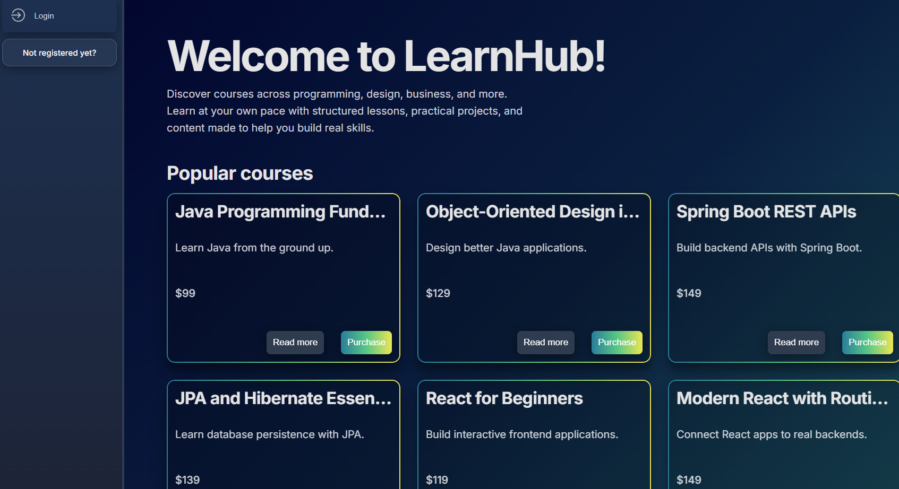
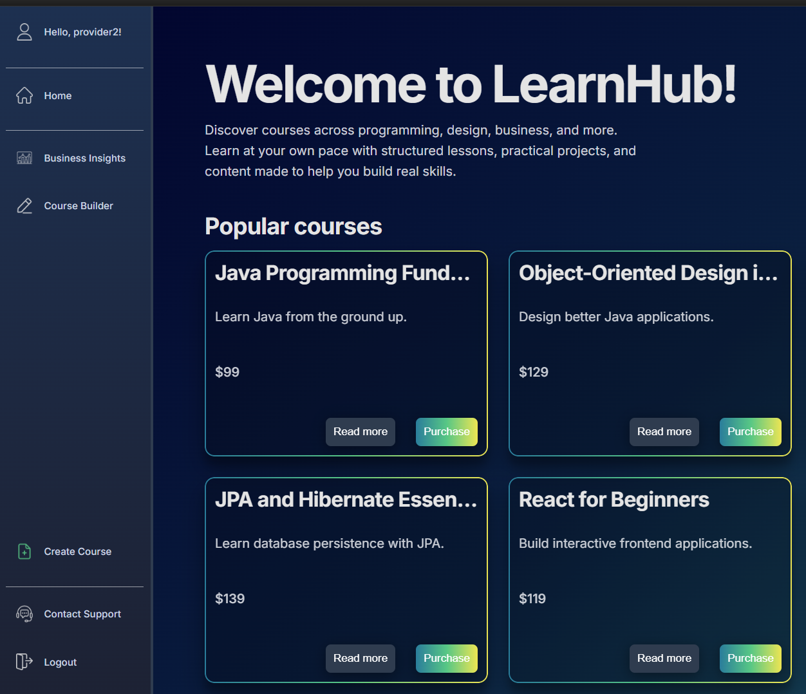
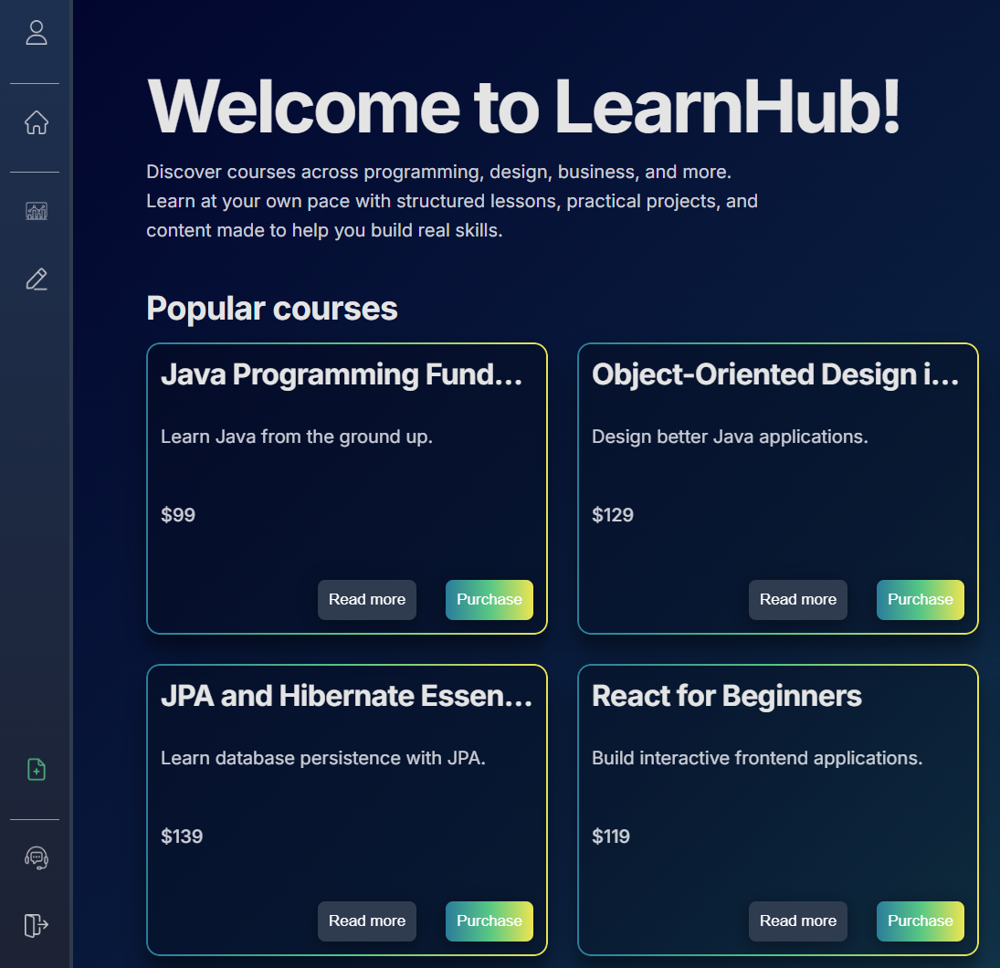
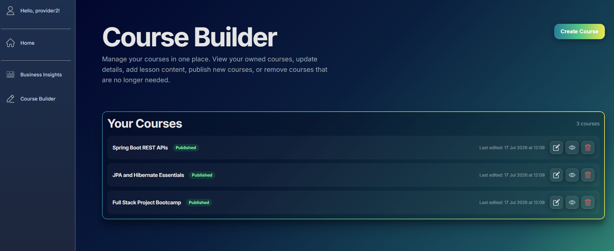
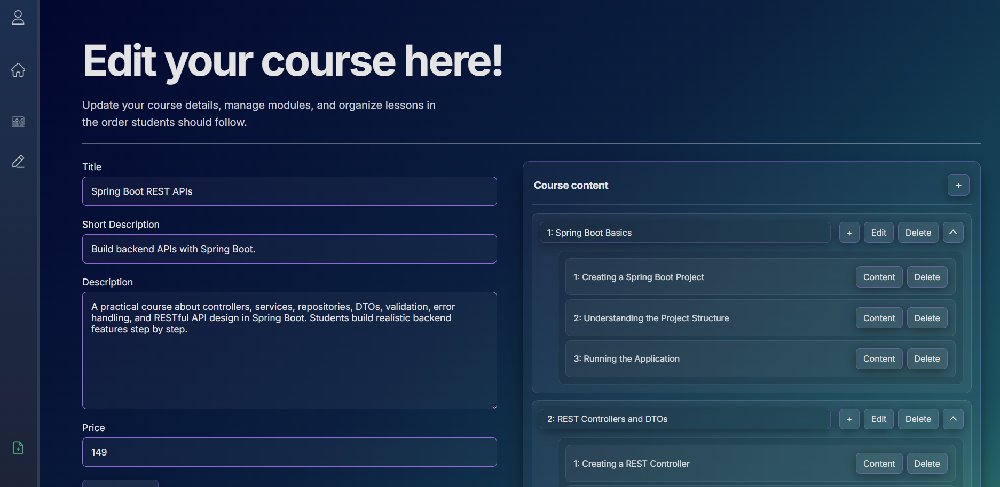
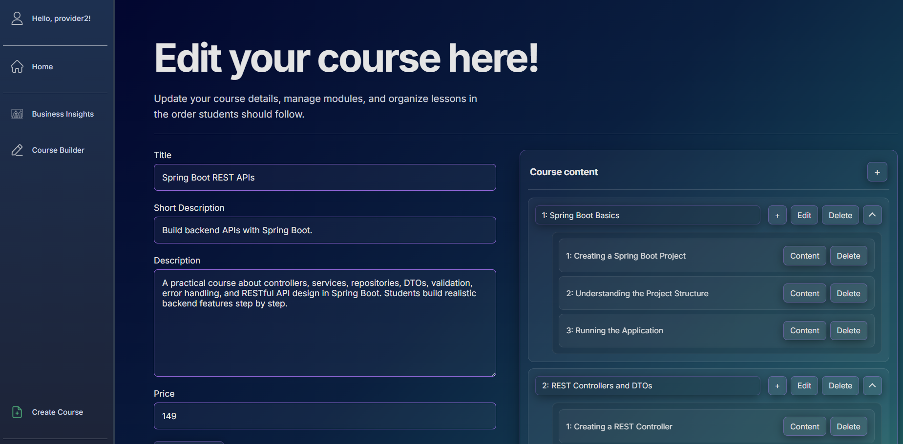
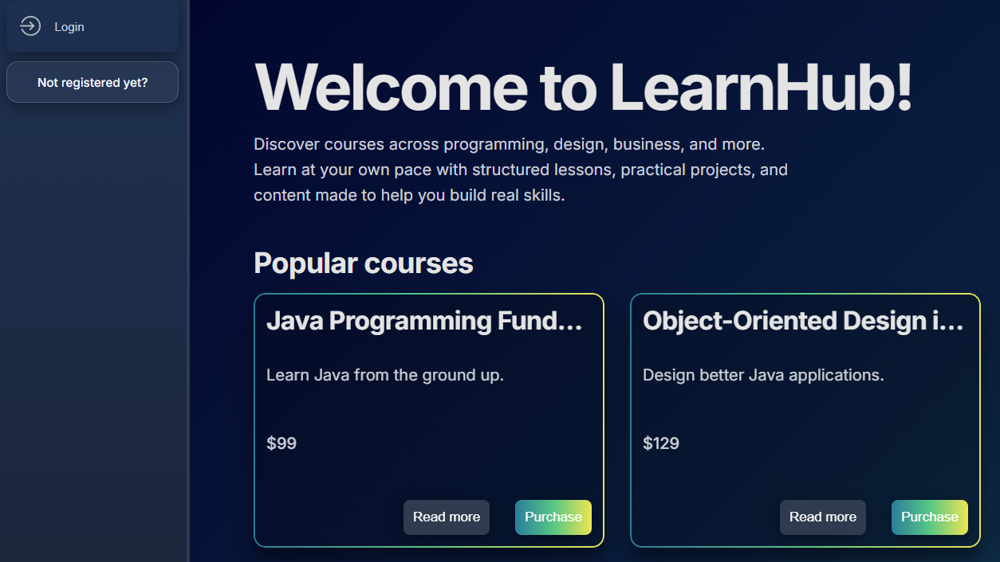

# From the first semester as a Software engineer


# Learning Management System

A full-stack learning management system developed as a second-semester Software Engineering project.

The platform allows course providers to create and manage courses, while participants can browse available courses, enroll and access structured learning content.

## Project overview

The application is built as a full-stack solution with a React frontend, a Spring Boot backend and a PostgreSQL database.

Courses are organised into modules, lessons and different types of content. The system also supports user roles, course enrollment and course administration.

## Features

- User registration and login
- Different user roles
- Create, edit and publish courses
- Organise courses into modules and lessons
- Add markdown, image and video content
- Browse available courses
- Enroll in courses
- Manage course participants
- Administrator functionality
- Persistent storage with PostgreSQL
- Backend validation and integration tests

## Tech stack

### Frontend

- React
- Vite
- React Router
- React Markdown
- Font Awesome
- CSS

### Screenshots









### Backend

- Java 21
- Spring Boot
- Spring Web MVC
- Spring Data JPA
- Hibernate
- PostgreSQL
- Maven
- Bean Validation
- Spring Security Crypto

### Testing

- JUnit
- Spring Boot Test
- Testcontainers
- PostgreSQL Testcontainers

## Architecture

The project is divided into two main applications:

```text
TS-SEP2-S26-Projekt
├── backend
│   └── Spring Boot REST API
└── frontend
    └── React and Vite application